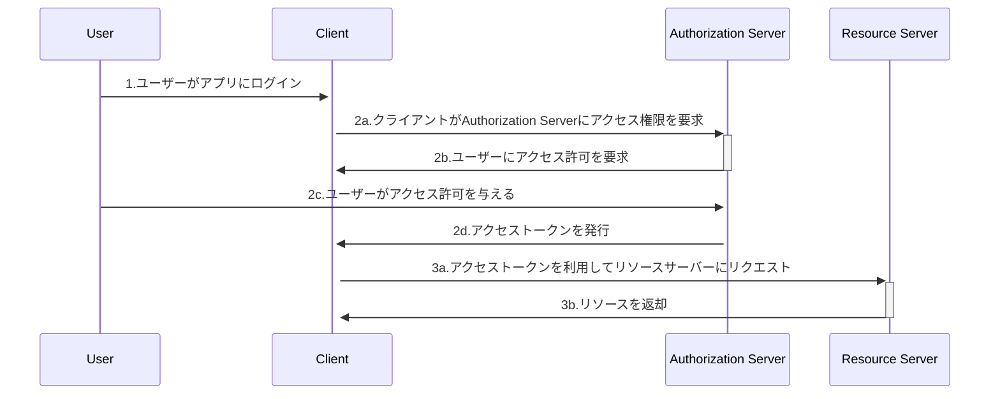

## 認証

- 認証は利用者を確認するプロセス。
- ホテルで言うところの「フロントで身分確認をし、カードを与える」部分。

## 認可

- 認可とは正当な利用者にシステムのリソースにアクセスする権限を与える行為。
- ホテルで言うところの「フロントでもらったカードを使って部屋に入る」部分。

## OAuth

- OAuthとは、外部のアプリが、特定のサービスにあるリソースに「ユーザーの承認を経て」アクセスするためのプロトコル。
- 下図で言うところの「ユーザーにアクセス許可を要求」が承認に当たる。

